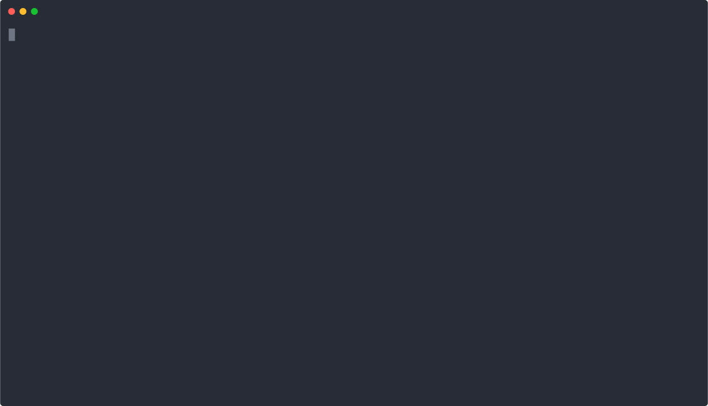

# Okarun 🌸

<p align="center">
  
</p>

Okarun is a powerful anime streaming tool that provides both a CLI and server interface to watch your favorite anime. Written in Go, it offers a seamless and interactive way to search, browse, and watch anime episodes.

## ✨ Features

- 🔍 Search for anime titles
- 📺 Watch the latest anime episodes
- 🌐 Multiple streaming servers support
- 🎮 Interactive CLI interface with pagination
- 🚀 RESTful API server

## 📋 Requirements

- Go 1.16 or higher
- MPV player for video playback
- Modern web browser for the server interface (Chromium base browser)

### Dependencies
```bash
# Install MPV player
# For Ubuntu/Debian
sudo apt install mpv

# For macOS
brew install mpv

# For Arch Linux
sudo pacman -S mpv
```

## 📥 Installation

### Using GitHub Releases

You can download the pre-compiled binaries for your operating system from the [GitHub releases page](https://github.com/frandier/okarun/releases).

1. Visit the [releases page](https://github.com/frandier/okarun/releases)
2. Download the appropriate version for your operating system:
   - For Linux: `okarun_linux_amd64.tar.gz`
   - For macOS: `okarun_darwin_amd64.tar.gz`
   - For Windows: `okarun_windows_amd64.zip`
3. Extract the downloaded archive
4. Move the binary to a location in your PATH:

```bash
# Linux/macOS (replace X.Y.Z with the version number)
tar xzf okarun_*_amd64.tar.gz
sudo mv okarun /usr/local/bin/

# Or move it to your local bin directory
mkdir -p ~/.local/bin
mv okarun ~/.local/bin/
```

### Windows Installation Steps

1. Extract the downloaded `okarun_windows_amd64.zip` file
2. You have two options:
   
   Option 1 - Add to System PATH:
   ```powershell
   # Create a directory for the application (PowerShell)
   New-Item -ItemType Directory -Path "$env:USERPROFILE\Applications\okarun" -Force

   # Move the extracted okarun.exe to the directory
   Move-Item -Path "okarun.exe" -Destination "$env:USERPROFILE\Applications\okarun"

   # Add to PATH (requires administrator PowerShell)
   $newPath = "$env:USERPROFILE\Applications\okarun"
   [Environment]::SetEnvironmentVariable("Path", $env:Path + ";$newPath", [EnvironmentVariableTarget]::User)
   ```

   Option 2 - Direct Use:
   - Create a folder like `C:\Programs\okarun`
   - Move `okarun.exe` to this folder
   - Create a shortcut to `okarun.exe` on your desktop or start menu

## 🚀Local development and Installation

1. Clone the repository:
```bash
git clone https://github.com/frandier/okarun.git
cd okarun
```

2. Install dependencies:
```bash
go get
```

3. Build the cli project:
```bash
make build-cli
```

4. Build the server project:
```bash
make build-server
```

## 💻 Usage

### CLI Interface

Run the CLI application:
```bash
./bin/cli/okarun
```

#### CLI Navigation
- Use ↑/↓ or j/k to navigate through lists
- Enter to select an option
- ESC to go back
- ←/→ or h/l to navigate through episode pages
- q or Ctrl+C to quit

#### CLI Features
1. **Recent Updates**
   - Browse the latest anime episodes
   - Select an episode to view available servers
   - Choose a server to start playback

2. **Search Anime**
   - Enter an anime title to search
   - Browse through search results
   - Navigate through episode pages
   - Select episodes to watch

### Server Interface

Start the server:
```bash
./bin/server/okarun
```

The server will start on `http://localhost:5000` by default.

#### API Endpoints

- `GET /latest` - Get latest anime episodes
- `GET /search?name={query}&page={page}` - Search for anime
- `GET /anime/{slug}` - Get anime details
- `GET /episodes/{slug}?page={page}` - Get episode list
- `GET /streaming/{server}/{episode}` - Get streaming URL

## 🛠️ Development

### Project Structure
```
├── cmd/
│   ├── cli/         # CLI application
│   └── server/      # HTTP server
├── internal/
│   ├── anime/       # Anime scraping and core logic
│   ├── cli/         # CLI UI components
│   ├── config/      # Configuration
│   └── handler/     # HTTP handlers
└── tmp/            # Temporary files
```

### Building from Source

1. Clone the repository
2. Install dependencies:
```bash
go mod download
```

3. Run tests:
```bash
make test
```

4. Build:
```bash
make build
```

## 🤝 Contributing

Contributions are welcome! Please feel free to submit a Pull Request.

## 📝 License

This project is licensed under the MIT License - see the LICENSE file for details.

## 🙏 Acknowledgments

- [Bubble Tea](https://github.com/charmbracelet/bubbletea) for the amazing terminal UI framework
- [MPV](https://mpv.io/) for the video playback support
